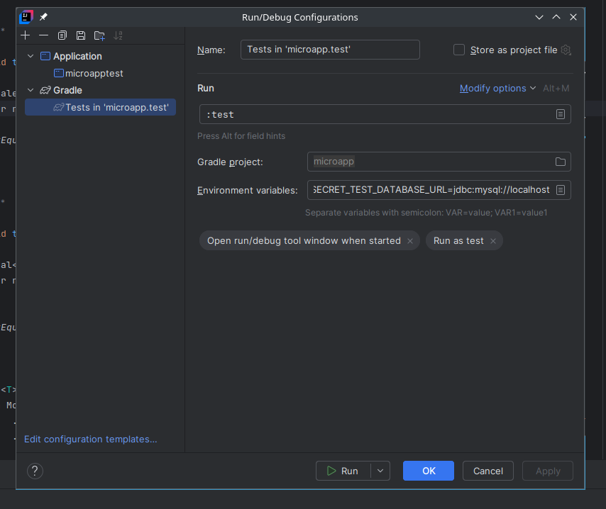
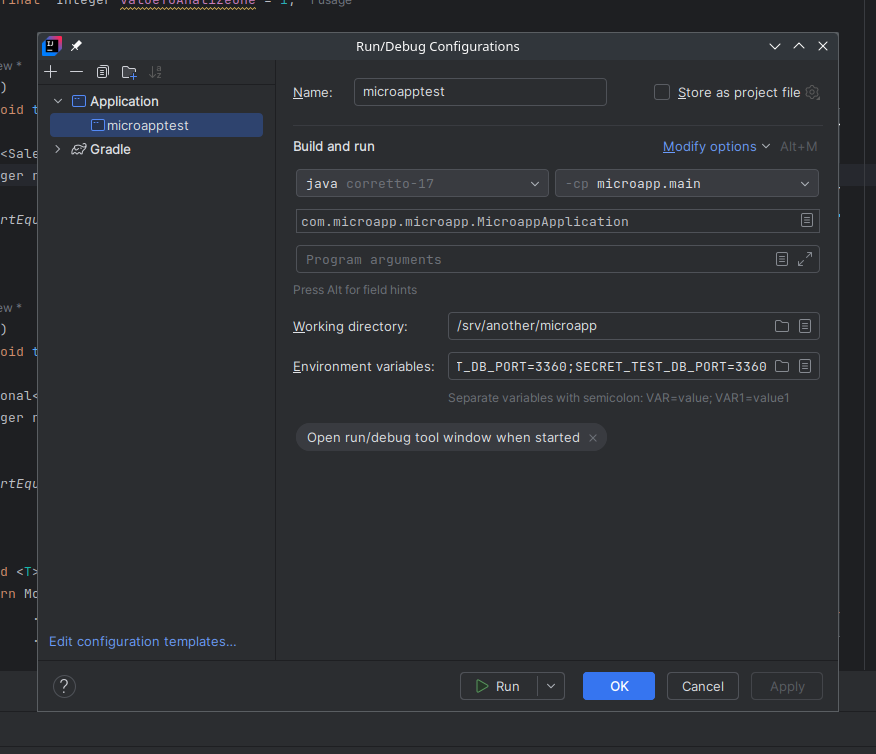
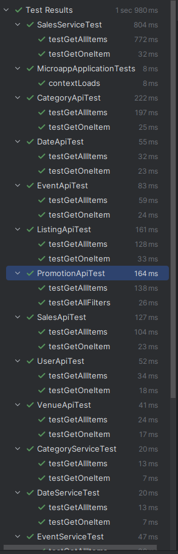

# MICRO API 

## Technical Specifications

This application has the following specifications: 

| Tool | Version |
| --- | --- |
| Docker | 24.0.7 |
| Docker Compose | 1.29.2 |
| Spring | 3.4.0 |
| Mariabd | Latest |

The application is separated by the following containers

| Service | Image | Motivação
| --- | --- | --- |
| mysql | mariadb:latest | Default database |
| spring | openjdk:17-jdk-slim | Application |

## Requirements
    - Docker
    - Docker Daemon (Service)
    - Docker Compose

## Installation Procedures
    Application Installation Procedures for Local Use

1- Download repository 
    
2 - Check if doors 80 and 3306 are occupied.

3 - Enter the base directory of the application and execute the commands below:
    
    0 - cp docker/envs/database.env.example docker/envs/database.env
        - cp docker/envs/app.env.example docker/envs/app.env

    1.0 - docker-compose up; 
        - to proccess
            - gradle building project jar
            - copy to final container
            - migrations runings
    1.1 - docker-compose up -d;

## Using Intelij

To use the project in Intelij run the Mysql instance

 -  docker-compose up mysql-db

#### Configure test battery
to configure follow the image below :

Note: It is not necessary to configure the env vars because the Mysql container is the default in application.yml.

#### Configure the application to run in the IDE
to configure follow the image below :

Note: It is not necessary to configure the env vars because the Mysql container is the default in application.yml.

## Configuring environment variables:

If you need to change the environment variables, set the following keys inside field:
Environment variables:

### Application :

SECRET_DATABASE_URL=jdbc:mysql://localhost
SECRET_DB_PORT=3306
SECRET_DB_NAME=example
SECRET_DB_USERNAME=example
SECRET_DB_PASSWORD=example

### Gradle Tests:

SECRET_TEST_DATABASE_URL=jdbc:mysql://localhost
SECRET_TEST_DB_PORT=3306
SECRET_TEST_DB_NAME=example1
SECRET_TEST_DB_USERNAME=example1
SECRET_TEST_DB_PASSWORD=example1

    
## Run Unit Tests

## Post Installation

After installing the access address is:

- http://localhost:8080/api/categories/?page=0&pageSize=10
- http://localhost:8080/api/categories/2

- http://localhost:8080/api/dates/?page=0&pageSize=10
- http://localhost:8080/api/dates/2

- http://localhost:8080/api/events/?page=0&pageSize=10
- http://localhost:8080/api/events/2

- http://localhost:8080/api/listings/?page=0&pageSize=10
- http://localhost:8080/api/listings/2

- http://localhost:8080/api/promotions/available?contextDate=2008-01-25&categoryId=9

- http://localhost:8080/api/sales/?page=0&pageSize=10
- http://localhost:8080/api/sales/2

- http://localhost:8080/api/users/?page=0&pageSize=10
- http://localhost:8080/api/users/2

- http://localhost:8080/api/venues/?page=0&pageSize=10
- http://localhost:8080/api/venues/2

- Pagination parameters are optional and have a default values

